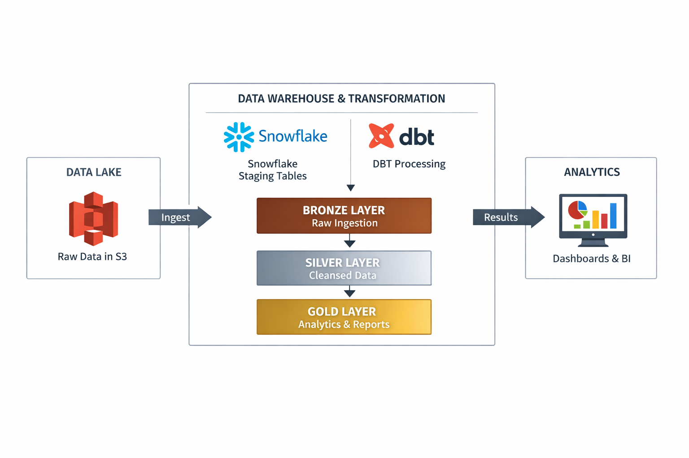

# Airbnb Data Engineering Pipeline (dbt + Snowflake + AWS S3)

This project implements an end-to-end ELT pipeline using dbt, Snowflake, and AWS S3.  
It ingests raw data from S3, transforms it through layered models (bronze, silver, gold), and produces analytics-ready datasets.

---

## 📊 Architecture


## 📊 dbt Model Lineage (End-to-End DAG)

This lineage graph represents the end-to-end ELT pipeline, highlighting dependencies between staging, transformation layers, and final analytical models.


---

## 🛠 Tech Stack

- dbt (data transformations)
- Snowflake (data warehouse)
- AWS S3 (data lake)
- GitHub (version control)

---

## 🧱 Data Pipeline Layers

### 🥉 Bronze Layer
- Raw ingestion from staging tables
- Incremental loading using `CREATED_AT`

### 🥈 Silver Layer
- Data cleaning and standardization
- Deduplication using window functions (`ROW_NUMBER`)
- Business transformations using macros

### 🥇 Gold Layer
- One Big Table (OBT) for analytics
- Fact and dimension models for reporting

---

## 🚀 Key Features

- Incremental data loading using dbt
- Merge-based upsert strategy using unique keys
- SCD Type 2 implementation using dbt snapshots
- Reusable SQL using Jinja macros
- Metadata-driven transformations
- Data quality checks (error & warning based)

---

## ▶️ How to Run

```bash
dbt run
dbt test
dbt snapshot
```

## Key Learnings

- Designed incremental pipelines to handle large datasets
- Implemented SCD Type 2 using dbt snapshots
- Built layered data models (bronze, silver, gold)
- Used macros and Jinja for reusable transformations
- Debugged Snowflake SQL and dbt compilation issues


## 📈 Business Use Case

This pipeline enables analysis of:
- Total booking revenue
- Average price per listing
- Host performance metrics
- City-level demand trends


