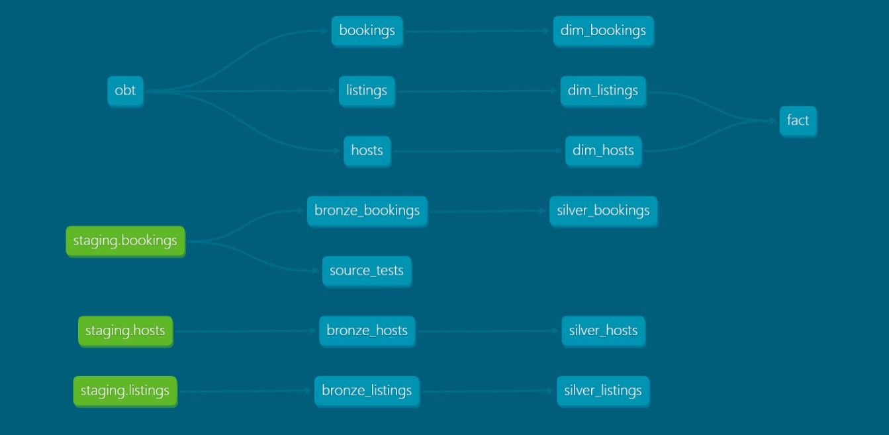
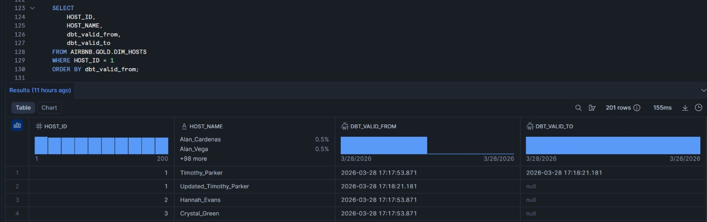

# Airbnb Data Engineering Pipeline (dbt + Snowflake + AWS S3)

## 🚀 Project Overview

Built an end-to-end ELT data pipeline using dbt, Snowflake, and AWS S3 to transform raw Airbnb data into analytics-ready datasets. The pipeline follows a Medallion Architecture (Bronze, Silver, Gold) and implements Slowly Changing Dimension (SCD Type 2) to track historical changes in host data.

---

## 📊 Architecture

### Architecture Explanation

- Raw Airbnb data is ingested into AWS S3
- Data is loaded into Snowflake (Bronze layer)
- dbt transforms data into:
  - Silver layer (cleaned & standardized)
  - Gold layer (analytics-ready models)
- dbt snapshots implement SCD Type 2 for historical tracking

## 📊 dbt Model Lineage (End-to-End DAG)

This lineage graph represents the end-to-end ELT pipeline, highlighting dependencies between staging, transformation layers, and final analytical models.
- Models are built using modular transformations with ref()
- Ensures dependency management and proper execution order
- Enables reproducibility and maintainability of transformations



---
## 🔄 Slowly Changing Dimension (SCD Type 2)

To handle historical changes in dimension data, this pipeline implements SCD Type 2 using dbt snapshots.

- Maintains full history of changes
- Uses `dbt_valid_from` and `dbt_valid_to`
- Enables time-based analysis of host attributes
- This design enables point-in-time analysis without losing historical data
### Example Output



### Explanation

- For `HOST_ID = 1`, multiple records exist representing historical changes
- When the host name changed from `Timothy_Parker` to `Updated_Timothy_Parker`, a new record was created
- The previous record’s `dbt_valid_to` was updated with the change timestamp
- The latest record has `dbt_valid_to = NULL`, indicating the current active version

## 🛠 Tech Stack

- dbt (ELT transformations, snapshots, testing)
- Snowflake (cloud data warehouse)
- AWS S3 (data lake storage)
- SQL (data transformation)
- Jinja (templating & macros)
- GitHub (version control & collaboration)

---

## 🧱 Data Pipeline Layers

### 🥉 Bronze Layer
- Raw ingestion from staging tables
- Incremental loading using `CREATED_AT`

### 🥈 Silver Layer
- Data cleaning and standardization
- Deduplication using window functions (`ROW_NUMBER`)
- Business transformations using macros

### 🥇 Gold Layer
- One Big Table (OBT) for analytics
- Fact and dimension models for reporting

---

## 🚀 Key Features

- Built an end-to-end ELT data pipeline using dbt and Snowflake
- Implemented incremental processing for efficient large-scale data handling
- Designed dimensional data models (fact & dimension tables)
- Implemented SCD Type 2 using dbt snapshots for historical tracking
- Developed reusable transformations using Jinja macros
- Integrated data quality checks using dbt tests

---

## ▶️ How to Run

```bash
dbt run
dbt test
dbt snapshot
```

## 📚 Key Learnings

- Designed incremental pipelines to handle large datasets
- Implemented SCD Type 2 using dbt snapshots
- Built layered data models (bronze, silver, gold)
- Used macros and Jinja for reusable transformations
- Debugged Snowflake SQL and dbt compilation issues


## 📈 Business Use Case

This pipeline enables analysis of:
- Total booking revenue
- Average price per listing
- Host performance metrics
- City-level demand trends


